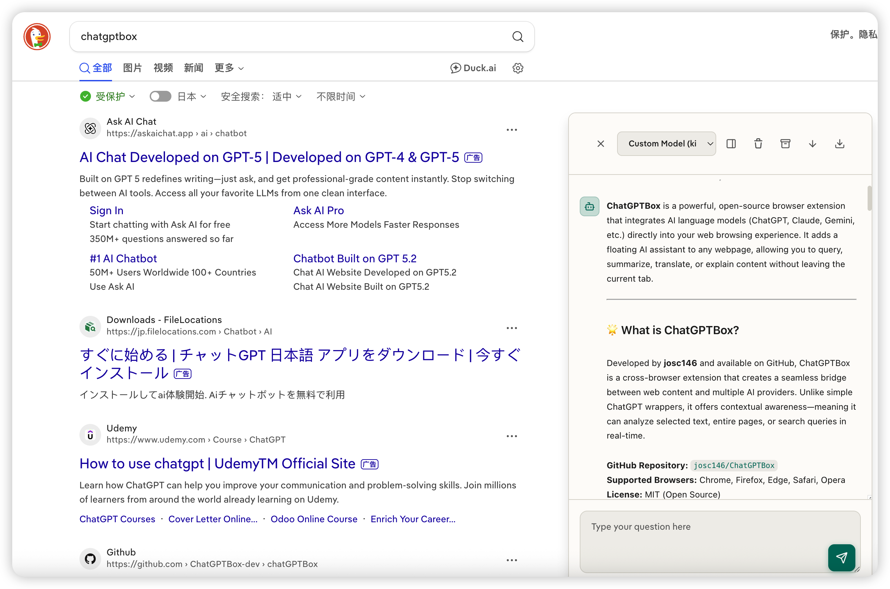
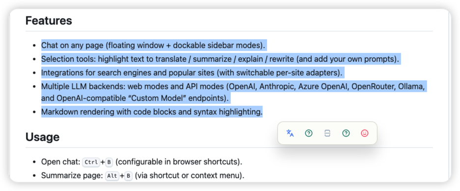
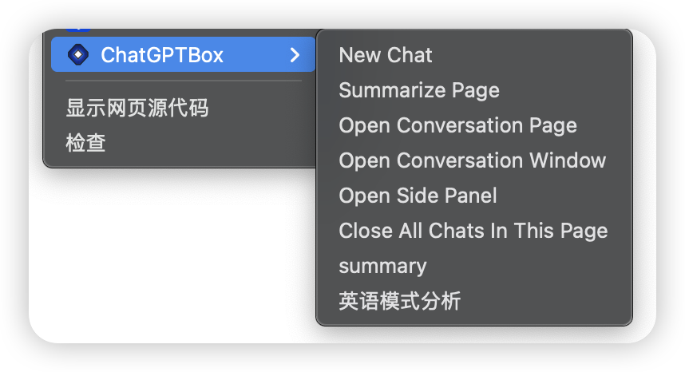
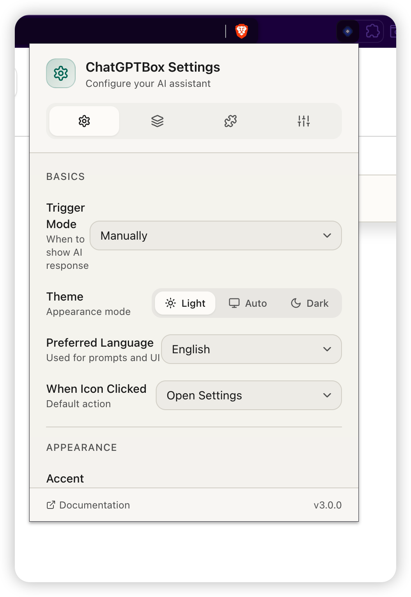
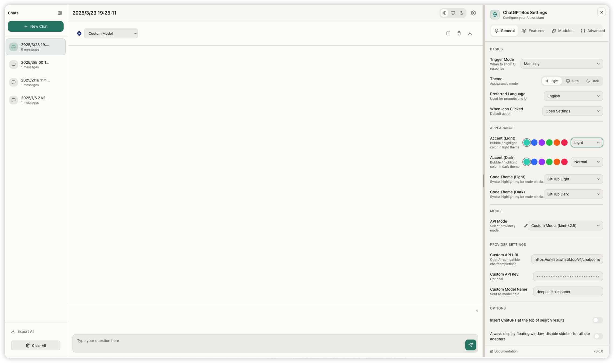
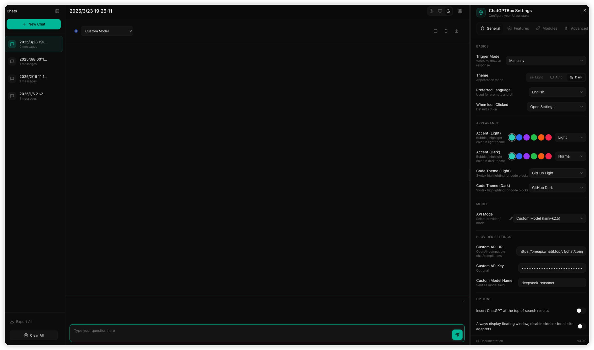
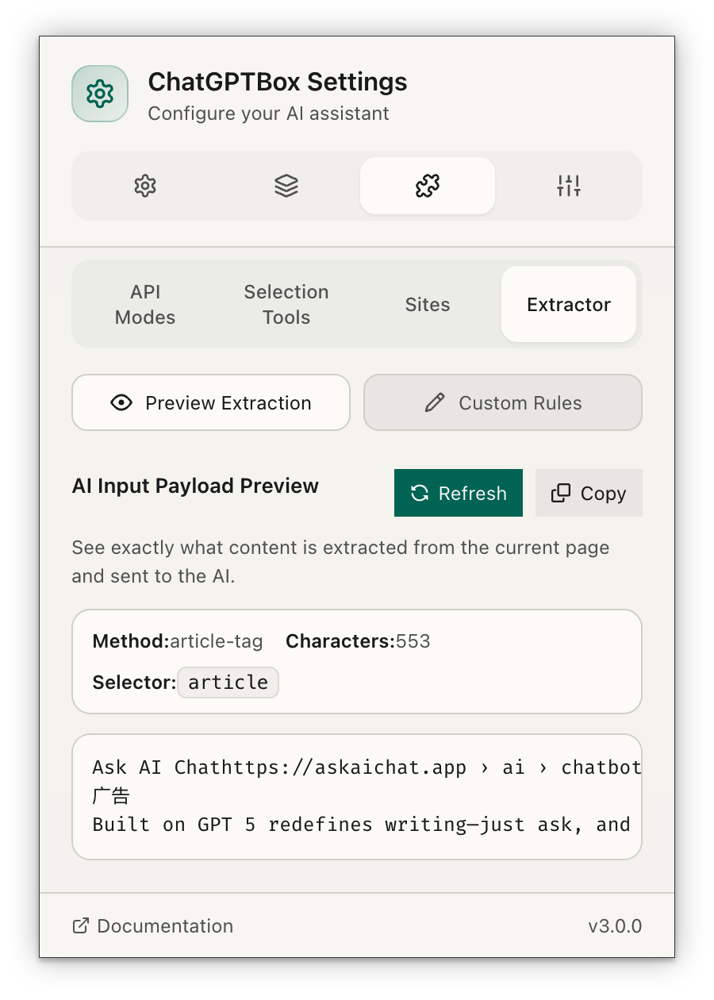

<p align="center">
  
</p>

<h1 align="center">ChatGPTBox</h1>

<div align="center">

AI assistant in your browser: selection tools, site integrations, a floating chat UI, and an independent conversation panel.

[![license][license-image]][license-url]
[![release][release-image]][release-url]
[![verify][verify-image]][verify-url]

[Install](#install) &nbsp;&nbsp;|&nbsp;&nbsp; [Features](#features) &nbsp;&nbsp;|&nbsp;&nbsp; [Screenshots](#screenshots) &nbsp;&nbsp;|&nbsp;&nbsp; [Usage](#usage) &nbsp;&nbsp;|&nbsp;&nbsp; [Configuration](#configuration) &nbsp;&nbsp;|&nbsp;&nbsp; [Development](#development) &nbsp;&nbsp;|&nbsp;&nbsp; [Credits](#credits)

</div>

## Install

Build installs:

- GitHub releases: https://github.com/aaaAlexanderaaa/chatGPTBox/releases

## Features

- Chat on any page (floating window + dockable sidebar modes).
- Selection tools: highlight text to translate / summarize / explain / rewrite (and add your own prompts).
- Integrations for search engines and popular sites (with switchable per-site adapters).
- Multiple LLM backends: web modes and API modes (OpenAI, Anthropic, Azure OpenAI, OpenRouter, Ollama, and OpenAI-compatible “Custom Model” endpoints).
- Markdown rendering with code blocks and syntax highlighting.

## Screenshots

<table>
  <tr>
    <td align="center" width="50%">
      <br />
      <b>Site Integration</b><br />
      <sub>Integrates with search engines like DuckDuckGo, showing AI responses alongside search results</sub>
    </td>
    <td align="center" width="50%">
      <br />
      <b>Selection Tools</b><br />
      <sub>Highlight text to access quick actions: translate, summarize, explain, and more</sub>
    </td>
  </tr>
  <tr>
    <td align="center" width="50%">
      <br />
      <b>Context Menu</b><br />
      <sub>Right-click menu for quick access to chat, summarize page, and other features</sub>
    </td>
    <td align="center" width="50%">
      <br />
      <b>Popup Window</b><br />
      <sub>Click the extension icon to access settings directly from the browser toolbar</sub>
    </td>
  </tr>
  <tr>
    <td align="center" width="50%">
      <br />
      <b>Options Page (Light Mode)</b><br />
      <sub>Full-featured settings panel with chat history and configuration options</sub>
    </td>
    <td align="center" width="50%">
      <br />
      <b>Options Page (Dark Mode)</b><br />
      <sub>Beautiful dark theme with customizable accent colors</sub>
    </td>
  </tr>
  <tr>
    <td align="center" colspan="2">
      <br />
      <b>Context Extractor</b><br />
      <sub>Preview and customize what content is extracted from web pages for AI context</sub>
    </td>
  </tr>
</table>

## Usage

- Open chat: <kbd>Ctrl</kbd>+<kbd>B</kbd> (configurable in browser shortcuts).
- Summarize page: <kbd>Alt</kbd>+<kbd>B</kbd> (via shortcut or context menu).
- Independent conversation panel: <kbd>Ctrl</kbd>+<kbd>Shift</kbd>+<kbd>H</kbd>.
- Select text on a page to open the selection toolbar.

## Configuration

Open the Settings UI from the extension icon (or open the extension options page). Main areas:

- **General**: model/provider selection, language, trigger behavior, and appearance (Light/Dark/Auto, accent color/strength, code theme).
- **Features**: enable/disable site integrations and page tools.
- **Modules**: API mode list, selection tools, and extractors.
- **Advanced**: context length, max tokens, temperature, custom endpoints, and export/import/reset settings.

Provider notes:

- **Custom Model** supports OpenAI-compatible endpoints (default: `http://localhost:8000/v1/chat/completions`).
- **Ollama** uses a local endpoint (default: `http://127.0.0.1:11434`).

## Development

```bash
npm install
npm run dev
```

Production build (outputs zipped builds under `build/`):

```bash
npm run build
```

## Privacy

ChatGPTBox runs locally in your browser. Network requests are only made to the providers/endpoints you configure and when you explicitly trigger a tool.

## Maintainer

This fork is maintained by [@aaaAlexanderaaa](https://github.com/aaaAlexanderaaa).

## Credits

This project is based on [josStorer/chatGPT-search-engine-extension](https://github.com/josStorer/chatGPT-search-engine-extension),
which was originally forked from [wong2/chat-gpt-google-extension](https://github.com/wong2/chat-gpt-google-extension) and inspired by
[ZohaibAhmed/ChatGPT-Google](https://github.com/ZohaibAhmed/ChatGPT-Google).

[license-image]: https://img.shields.io/badge/license-MIT-blue.svg
[license-url]: https://github.com/aaaAlexanderaaa/chatGPTBox/blob/master/LICENSE

[release-image]: https://img.shields.io/github/v/release/aaaAlexanderaaa/chatGPTBox?display_name=tag
[release-url]: https://github.com/aaaAlexanderaaa/chatGPTBox/releases/latest

[verify-image]: https://github.com/aaaAlexanderaaa/chatGPTBox/actions/workflows/verify-configs.yml/badge.svg
[verify-url]: https://github.com/aaaAlexanderaaa/chatGPTBox/actions/workflows/verify-configs.yml

[Chrome-image]: https://img.shields.io/badge/-Chrome-brightgreen?logo=google-chrome&logoColor=white
[Chrome-url]: https://chrome.google.com/webstore/detail/chatgptbox/eobbhoofkanlmddnplfhnmkfbnlhpbbo

[Edge-image]: https://img.shields.io/badge/-Edge-blue?logo=microsoft-edge&logoColor=white
[Edge-url]: https://microsoftedge.microsoft.com/addons/detail/fission-chatbox-best/enjmfilpkbbabhgeoadmdpjjpnahkogf

[Firefox-image]: https://img.shields.io/badge/-Firefox-orange?logo=firefox-browser&logoColor=white
[Firefox-url]: https://addons.mozilla.org/firefox/addon/chatgptbox/

[Safari-image]: https://img.shields.io/badge/-Safari-blue?logo=safari&logoColor=white
[Safari-url]: https://apps.apple.com/app/fission-chatbox/id6446611121
