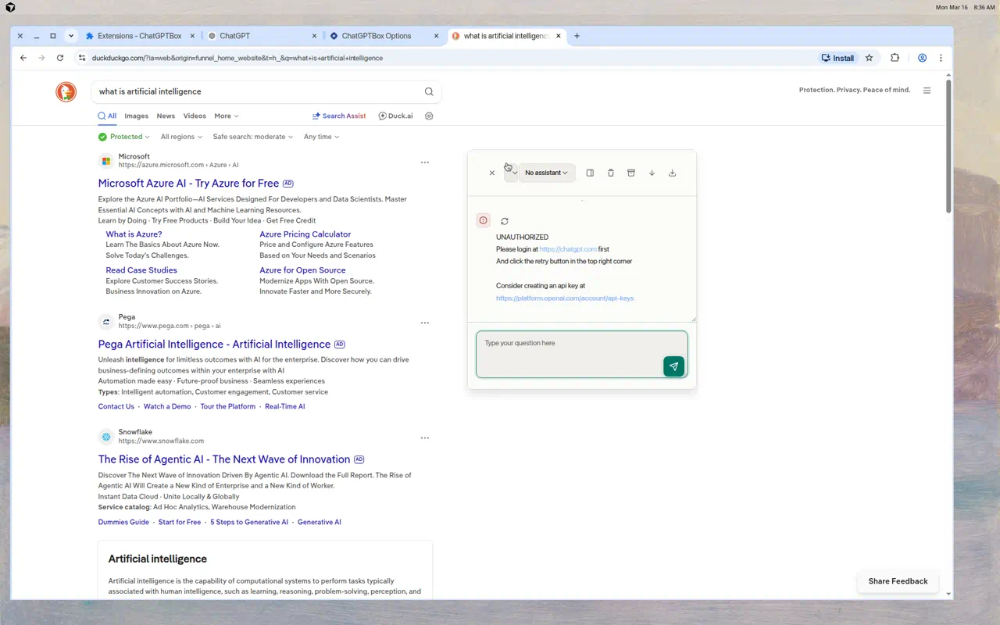
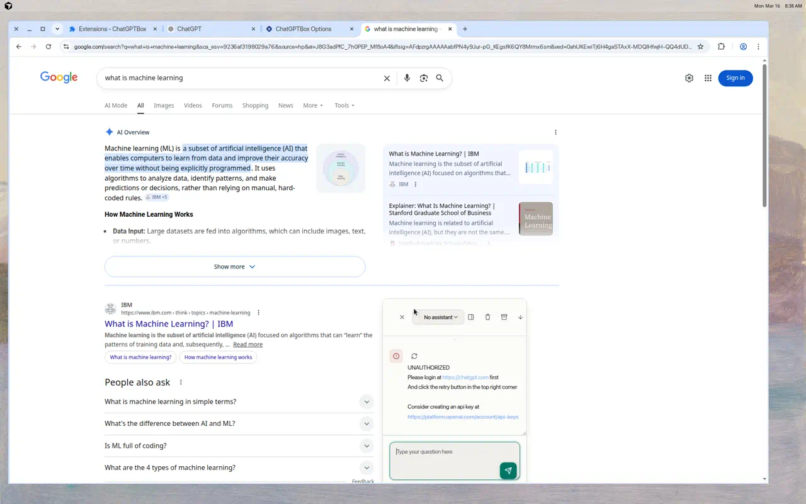
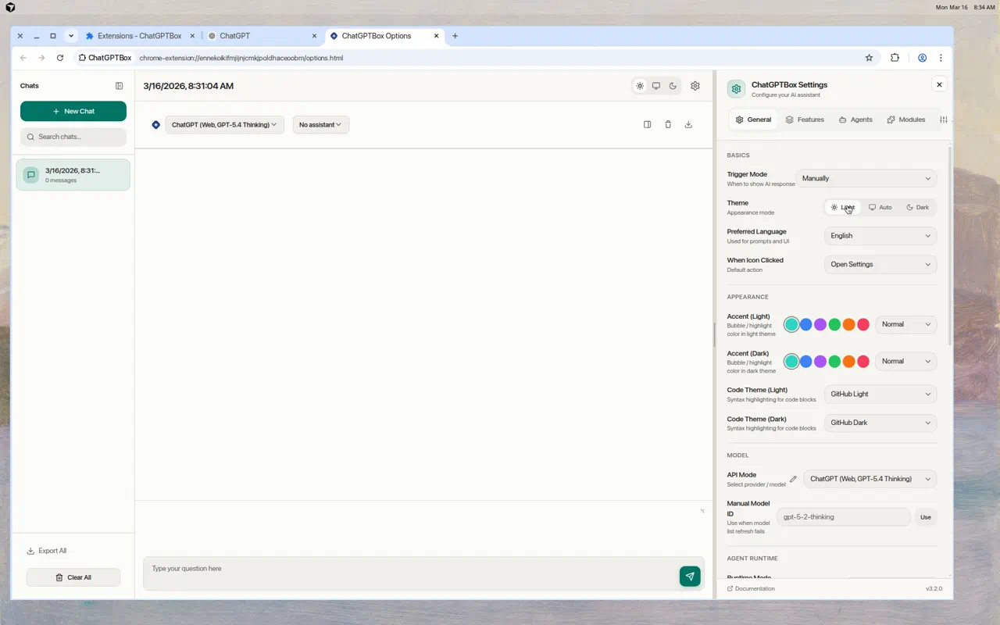
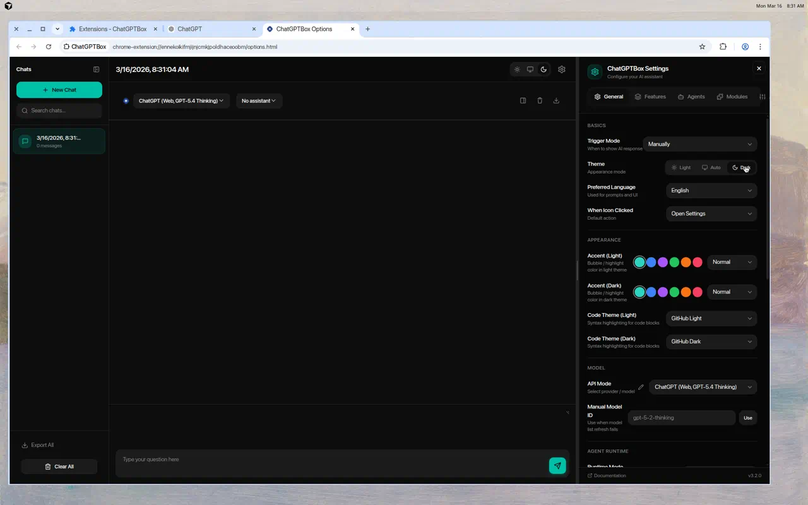
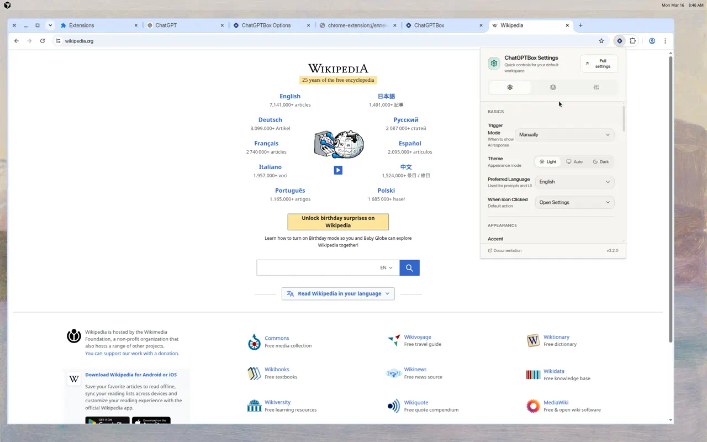
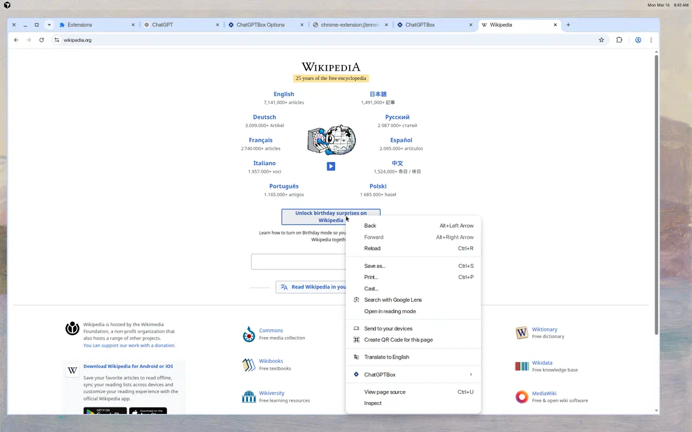
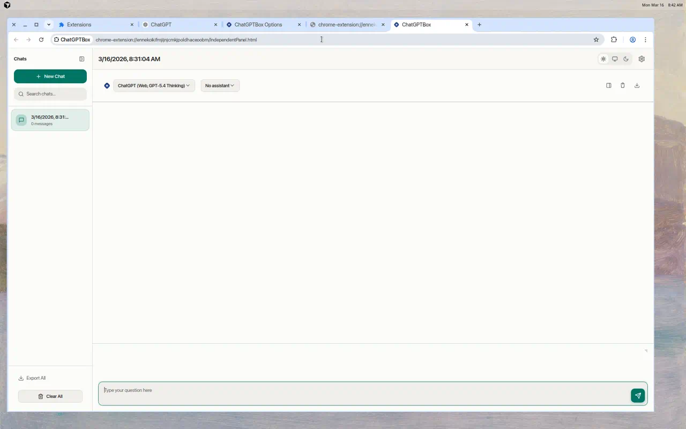
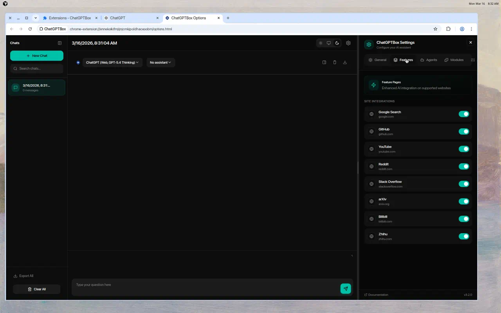
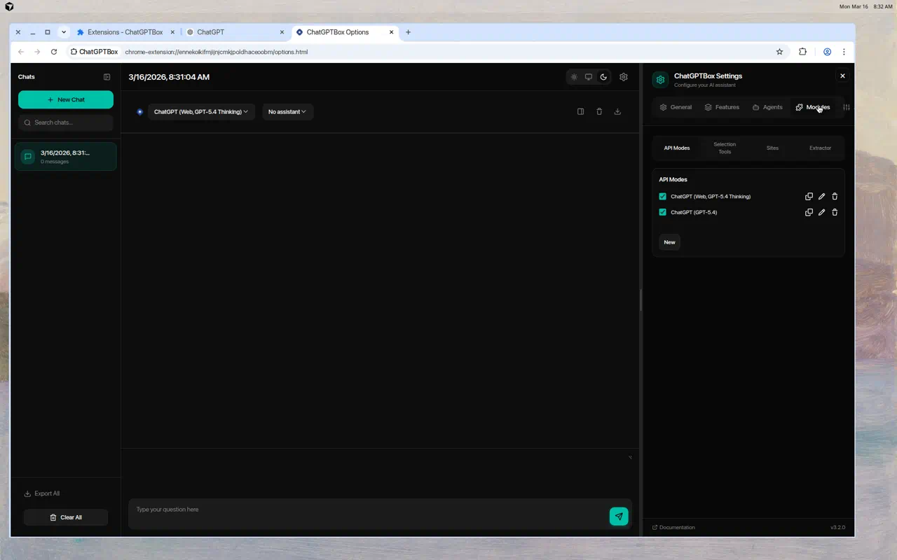

<p align="center">
  
</p>

<h1 align="center">ChatGPTBox</h1>

<div align="center">

AI assistant in your browser: selection tools, site integrations, a floating chat UI, and an independent conversation panel.

[![license][license-image]][license-url]
[![release][release-image]][release-url]
[![verify][verify-image]][verify-url]

English &nbsp;&nbsp;|&nbsp;&nbsp; [中文](./README_CN.md)

[Features](#features) &nbsp;&nbsp;|&nbsp;&nbsp; [Screenshots](#screenshots) &nbsp;&nbsp;|&nbsp;&nbsp; [Install](#install) &nbsp;&nbsp;|&nbsp;&nbsp; [Usage](#usage) &nbsp;&nbsp;|&nbsp;&nbsp; [Configuration](#configuration) &nbsp;&nbsp;|&nbsp;&nbsp; [Development](#development) &nbsp;&nbsp;|&nbsp;&nbsp; [API Server Bridge](#api-server-bridge) &nbsp;&nbsp;|&nbsp;&nbsp; [Changelog](#changelog) &nbsp;&nbsp;|&nbsp;&nbsp; [Credits](#credits)

</div>

## Features

- Chat on any page with floating chat, independent conversation page/window, and side-panel support.
- Selection tools for translate / summarize / explain / rewrite, plus user-defined custom selection prompts.
- Site integrations for search engines and supported sites such as Google, GitHub, YouTube, Reddit, Stack Overflow, arXiv, Bilibili, and Zhihu.
- Web and API provider support, including ChatGPT Web plus API/custom runtimes such as OpenAI, Anthropic, Azure OpenAI, OpenRouter, AIML, DeepSeek, Moonshot, Ollama, ChatGLM, and OpenAI-compatible custom endpoints.
- Agent runtime with assistants, ZIP-imported skills, built-in MCP toolkits, and external HTTP/SSE JSON-RPC MCP servers.
- Local API Server Bridge that exposes ChatGPT Web through an OpenAI-compatible `/v1/chat/completions` endpoint plus cached conversation inspection and follow-up APIs.
- Markdown rendering with code blocks, syntax highlighting, and KaTeX in the full build.

## Screenshots

<table>
  <tr>
    <td align="center" width="50%">
      <br />
      <b>Site Integration</b><br />
      <sub>Integrates with search engines like DuckDuckGo, showing AI responses alongside search results</sub>
    </td>
    <td align="center" width="50%">
      <br />
      <b>Google Integration</b><br />
      <sub>AI assistant panel alongside Google search results</sub>
    </td>
  </tr>
  <tr>
    <td align="center" width="50%">
      <br />
      <b>Options Page (Light Mode)</b><br />
      <sub>Full-featured settings panel with chat history and configuration options</sub>
    </td>
    <td align="center" width="50%">
      <br />
      <b>Options Page (Dark Mode)</b><br />
      <sub>Beautiful dark theme with customizable accent colors</sub>
    </td>
  </tr>
  <tr>
    <td align="center" width="50%">
      <br />
      <b>Popup Window</b><br />
      <sub>Click the extension icon to access quick settings directly from the browser toolbar</sub>
    </td>
    <td align="center" width="50%">
      <br />
      <b>Context Menu</b><br />
      <sub>Right-click menu for quick access to chat, summarize page, and other features</sub>
    </td>
  </tr>
  <tr>
    <td align="center" width="50%">
      <br />
      <b>Independent Conversation Panel</b><br />
      <sub>Dedicated conversation page opened via keyboard shortcut or context menu</sub>
    </td>
    <td align="center" width="50%">
      <br />
      <b>Site Integrations</b><br />
      <sub>Toggle integrations for Google, GitHub, YouTube, Reddit, Stack Overflow, and more</sub>
    </td>
  </tr>
  <tr>
    <td align="center" width="50%">
      <br />
      <b>Agents &amp; Assistants</b><br />
      <sub>Manage assistants, imported skill packs, and MCP servers</sub>
    </td>
    <td align="center" width="50%">
      <br />
      <b>Modules &amp; API Modes</b><br />
      <sub>Configure API modes, selection tools, site adapters, and content extractors</sub>
    </td>
  </tr>
</table>

## Install

This is a community fork. It is not listed on official browser extension stores.

To install, grab a build from [GitHub Releases](https://github.com/aaaAlexanderaaa/chatGPTBox/releases) or build from source:

```bash
npm ci
npm run dev        # development build → build/chromium/, build/firefox/
npm run build      # production build → build/*.zip
```

Load the extension:

- **Chromium-based browsers**: enable Developer mode on the extensions page and load `build/chromium/` as an unpacked extension.
- **Firefox**: load `build/firefox/` as a temporary add-on.

## Usage

- Open chat: <kbd>Ctrl</kbd>+<kbd>B</kbd> (configurable in browser shortcuts).
- Summarize page: <kbd>Alt</kbd>+<kbd>B</kbd> (via shortcut or context menu).
- Independent conversation panel: <kbd>Ctrl</kbd>+<kbd>Shift</kbd>+<kbd>H</kbd>.
- Select text on a page to open the selection toolbar.
- Click the extension icon to open the quick workspace with `General`, `Sites`, and `Advanced`. Use `Full settings` for the complete configuration workspace.

## Configuration

Open the Settings UI from the extension icon or the extension options page.

- The toolbar popup is a quick workspace with `General`, `Sites`, and `Advanced`, plus a `Full settings` button.
- The full settings workspace exposes all top-level tabs: `General`, `Features`, `Agents`, `Modules`, and `Advanced`.

Main areas in the full settings workspace:

- **General**: model/provider selection, language, trigger behavior, appearance, runtime mode, default assistant, and agent protocol.
- **Features**: enable/disable supported site integrations.
- **Agents**: assistants, imported ZIP skill packs, and MCP servers.
- **Modules**: API modes, selection tools, site adapters, and content extractors.
- **Advanced**: context length, max tokens, temperature, custom endpoints, debug/export/import/reset settings.

Agent/runtime notes:

- Imported skills are agent/runtime assets and live under **Agents -> Skills**.
- Legacy custom selection tools remain separate under **Modules -> Selection Tools**.
- In `safe` runtime mode, MCP HTTP endpoints are expected to use HTTPS; `developer` mode is more permissive.
- Assistant / Skills / MCP are intended for API/custom runtime flows. ChatGPT Web models continue to work for normal chat, but they do not use the full agent-context path.

Provider notes:

- **Custom Model** supports OpenAI-compatible endpoints (default: `http://localhost:8000/v1/chat/completions`).
- **Ollama** uses a local endpoint (default: `http://127.0.0.1:11434`).

## Development

ChatGPTBox targets **Node.js 20** in CI.

```bash
export NVM_DIR="$HOME/.nvm"
[ -s "$NVM_DIR/nvm.sh" ] && . "$NVM_DIR/nvm.sh"
nvm use 20
npm ci
```

Common commands:

```bash
npm run dev
npm run lint
npm run test:agent
npm run verify
npm run pretty
npm run build
npm run build:safari
npm run api-server
```

`npm run dev` writes unpacked browser builds to:

- `build/chromium/`
- `build/firefox/`

Browser testing:

- Chromium-based browsers: enable Developer mode on the extensions page and load `build/chromium/`.
- Firefox: load `build/firefox/` as a temporary add-on.
- Without a valid provider credential or ChatGPT Web login, sending a chat request can return `UNAUTHORIZED`. That usually means missing auth, not a broken build.

Production build outputs zipped builds under `build/`:

```bash
npm run build
```

Artifacts include:

- `build/chromium.zip`
- `build/firefox.zip`
- `build/chromium-without-katex-and-tiktoken.zip`
- `build/firefox-without-katex-and-tiktoken.zip`

Safari packaging is separate and requires macOS/Xcode:

```bash
npm run build:safari
```

## API Server Bridge

ChatGPTBox includes a local OpenAI-compatible gateway that proxies ChatGPT Web through the extension:

- Open `Advanced -> API Server Bridge -> Open API Server Bridge` in the extension.
- On that page, turn on `Enable API Server Bridge`.
- Start the local server with `npm run api-server`.
- Keep the API Server page open while using the gateway.
- Make sure you are logged in at [chatgpt.com](https://chatgpt.com).
- Send requests to `http://127.0.0.1:18080/v1/chat/completions` by default.

If you need to open the page manually, you can also run this from the extension service worker console:

```js
chrome.tabs.create({ url: chrome.runtime.getURL('ApiServer.html') })
```

How the bridge works:

- Your client sends an HTTP request to the local Node.js gateway in [`scripts/api-server.mjs`](./scripts/api-server.mjs).
- The gateway forwards the request to the extension page at [`src/pages/ApiServer/App.jsx`](./src/pages/ApiServer/App.jsx) over WebSocket or HTTP polling.
- That page asks the extension background to send the prompt through the ChatGPT Web flow.
- The response is streamed back to your client in an OpenAI-compatible format.

Supported endpoints:

- `POST /v1/chat/completions`
- `GET /v1/models`
- `GET /status`
- `GET /health`
- `GET /chatgpt/conversations`
- `GET /chatgpt/conversations/:id`
- `POST /chatgpt/conversations/:id/messages`
- `POST /chatgpt/conversations/:id/refresh`

Gateway configuration:

- CLI flags: `--port`, `--host`, `--timeout-seconds`, `--thinking-timeout-seconds`
- Environment variables: `CHATGPT_GATEWAY_PORT`, `CHATGPT_GATEWAY_HOST`, `CHATGPT_GATEWAY_TIMEOUT_SECONDS`, `CHATGPT_GATEWAY_THINKING_TIMEOUT_SECONDS`
- Extension settings: `Keep API Server chats in ChatGPT history`, `API request timeout (s)`, `Thinking request timeout (s)`

The default health endpoint is `http://127.0.0.1:18080/health`.

Conversation API notes:

- `GET /chatgpt/conversations` returns the locally cached ChatGPT Web list in the upstream-style shape. Add `force_sync=true` to trigger a fresh sync before reading it.
- `GET /chatgpt/conversations/:id` returns a normalized conversation snapshot. Add `think=true` to include reasoning-related nodes and `force_refresh=true` to fetch a fresh snapshot immediately.
- `POST /chatgpt/conversations/:id/messages` sends a follow-up into an existing ChatGPT conversation, then refreshes the snapshot.
- `POST /chatgpt/conversations/:id/refresh` refreshes a conversation and can optionally resume pending assistant output.

Full API server docs: [`docs/api-server.md`](./docs/api-server.md)

## Architecture Notes

- The extension is fully client-side. There is no project backend or database.
- Imported skills are ZIP packages that must contain `SKILL.md`.
- Built-in assistants, built-in skills, and built-in MCP toolkits are defined in [`src/config/index.mjs`](./src/config/index.mjs).
- The current runtime overview lives in [`docs/agents-runtime-v2.md`](./docs/agents-runtime-v2.md).

## Privacy

ChatGPTBox runs locally in your browser. Network requests are only made to the providers/endpoints you configure and when you explicitly trigger a tool.

## Changelog

### v3.2.1

- Added cached ChatGPT conversation APIs to the local API Server Bridge, including list, detail, create, follow-up message, and refresh endpoints.
- Added local conversation caching plus draft workflow scripts for inspecting threads and sending queued follow-ups through the gateway.
- Redesigned the settings experience around quick settings and clearer top-level tabs for General, Features, Agents, Modules, and Advanced configuration.
- Improved gateway and Brave compatibility with reverse-port messaging, connection health handling, buffered websocket events, and safer settings-page behavior.
- Updated model handling so ChatGPT Web conversation requests preserve upstream slugs and work with the newer dynamic model list flow.
- Expanded the API server documentation with exact endpoint behavior, cache semantics, and request/response examples.
- Improved ChatGPT Web bridge reliability on Brave and macOS with safer proxy routing, connection recovery, and buffered websocket handling.

## Maintainer

This fork is maintained by [@aaaAlexanderaaa](https://github.com/aaaAlexanderaaa).

## Credits

This project is forked from [ChatGPTBox-dev/chatGPTBox](https://github.com/ChatGPTBox-dev/chatGPTBox),
which was originally based on [josStorer/chatGPT-search-engine-extension](https://github.com/josStorer/chatGPT-search-engine-extension),
itself forked from [wong2/chat-gpt-google-extension](https://github.com/wong2/chat-gpt-google-extension) and inspired by
[ZohaibAhmed/ChatGPT-Google](https://github.com/ZohaibAhmed/ChatGPT-Google).

[license-image]: https://img.shields.io/badge/license-MIT-blue.svg
[license-url]: https://github.com/aaaAlexanderaaa/chatGPTBox/blob/master/LICENSE

[release-image]: https://img.shields.io/github/v/release/aaaAlexanderaaa/chatGPTBox?display_name=tag
[release-url]: https://github.com/aaaAlexanderaaa/chatGPTBox/releases/latest

[verify-image]: https://github.com/aaaAlexanderaaa/chatGPTBox/actions/workflows/verify-configs.yml/badge.svg
[verify-url]: https://github.com/aaaAlexanderaaa/chatGPTBox/actions/workflows/verify-configs.yml
