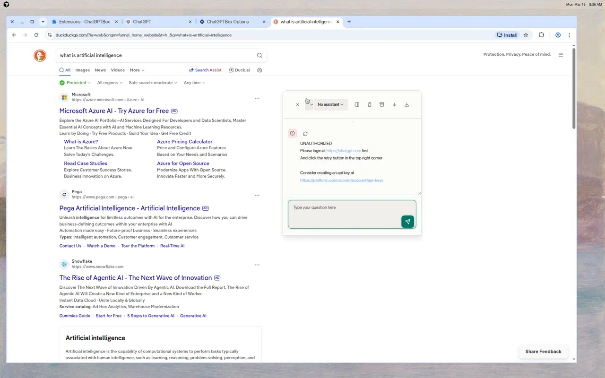
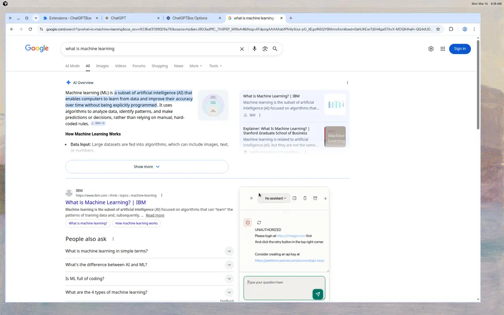
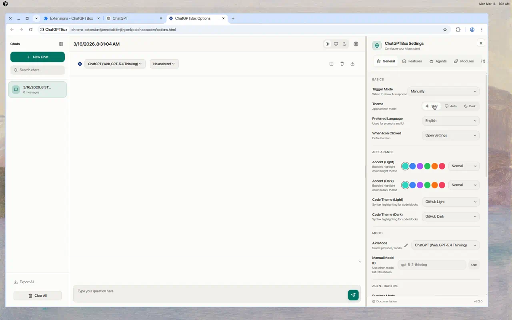
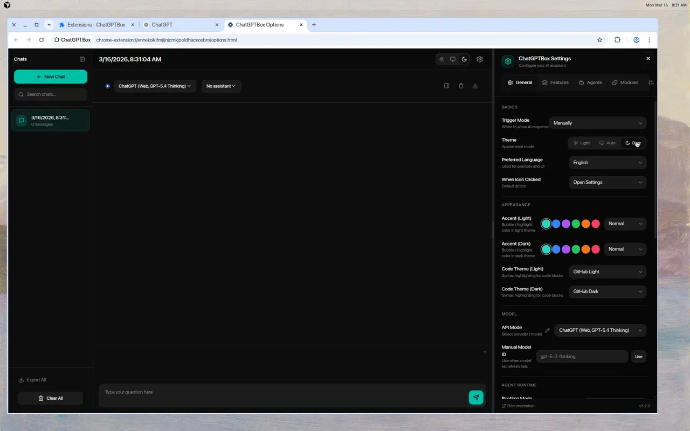
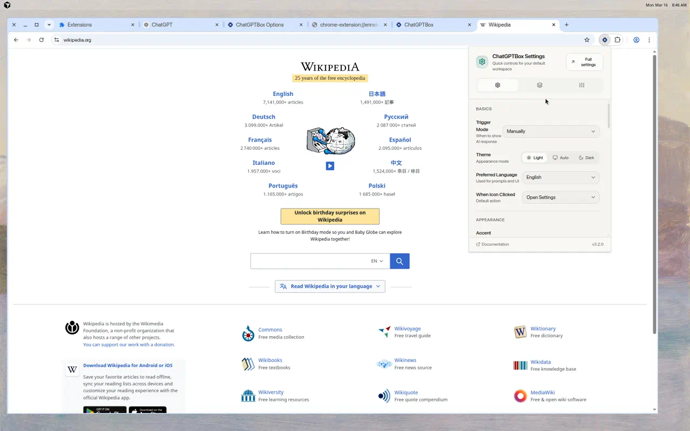
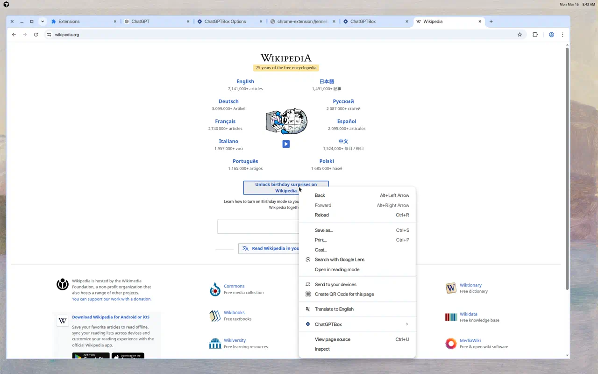
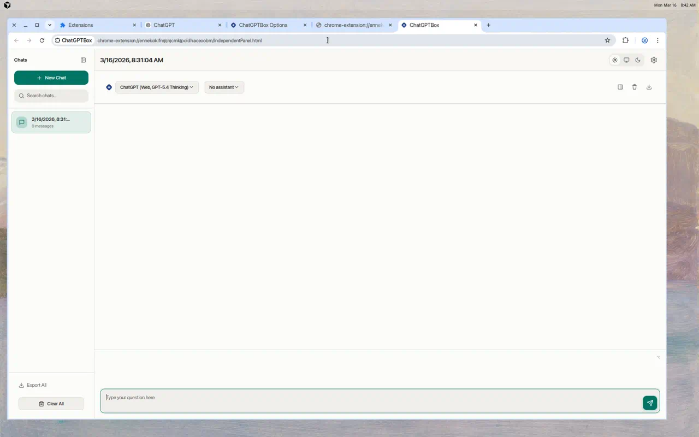
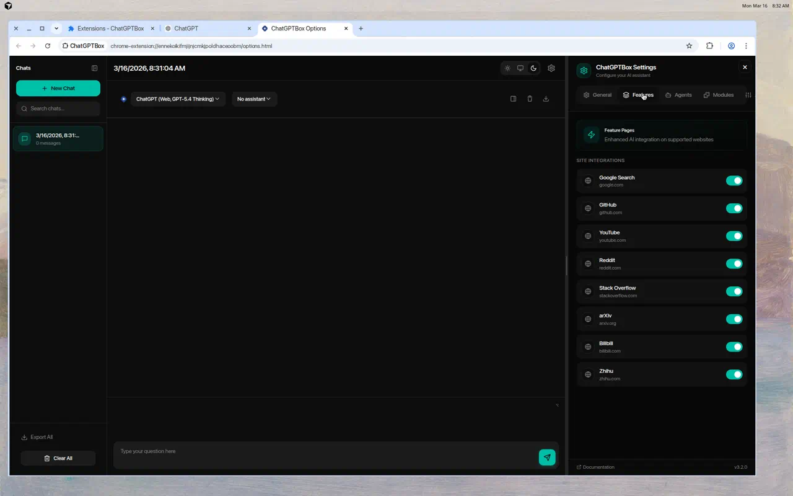
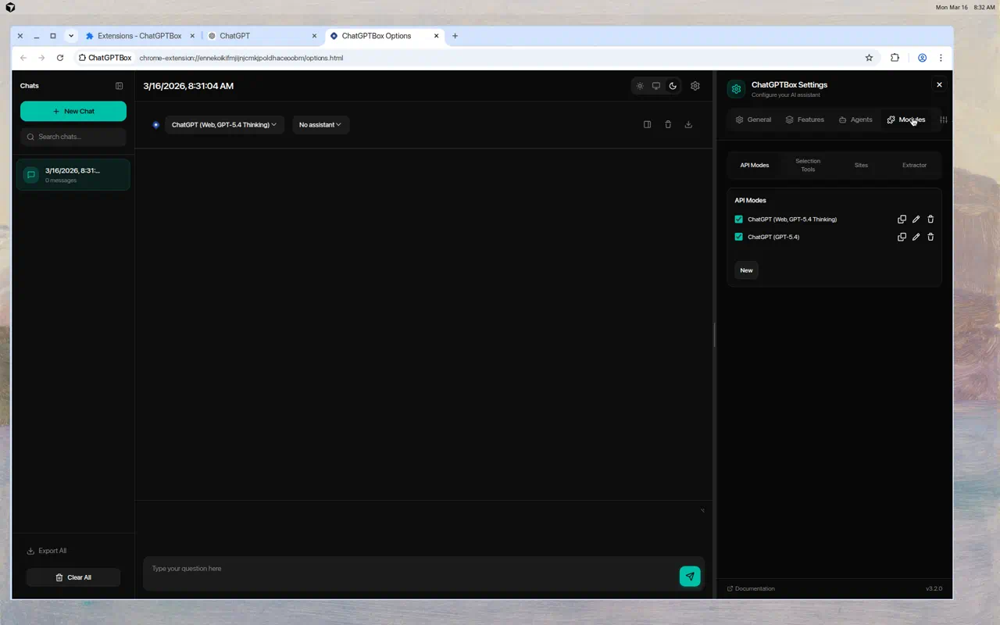

<p align="center">
  
</p>

<h1 align="center">ChatGPTBox</h1>

<div align="center">

AI assistant in your browser: selection tools, site integrations, a floating chat UI, and an independent conversation panel.

[![license][license-image]][license-url]
[![release][release-image]][release-url]
[![verify][verify-image]][verify-url]

English &nbsp;&nbsp;|&nbsp;&nbsp; [中文](./README_CN.md)

[Features](#features) &nbsp;&nbsp;|&nbsp;&nbsp; [Screenshots](#screenshots) &nbsp;&nbsp;|&nbsp;&nbsp; [Install](#install) &nbsp;&nbsp;|&nbsp;&nbsp; [Usage](#usage) &nbsp;&nbsp;|&nbsp;&nbsp; [Configuration](#configuration) &nbsp;&nbsp;|&nbsp;&nbsp; [Development](#development) &nbsp;&nbsp;|&nbsp;&nbsp; [API Server Bridge](#api-server-bridge) &nbsp;&nbsp;|&nbsp;&nbsp; [Changelog](#changelog) &nbsp;&nbsp;|&nbsp;&nbsp; [Credits](#credits)

</div>

## Features

- Chat on any page with floating chat, independent conversation page/window, and side-panel support.
- Selection tools for translate / summarize / explain / rewrite, plus user-defined custom selection prompts.
- Site integrations for search engines and supported sites such as Google, GitHub, YouTube, Reddit, Stack Overflow, arXiv, Bilibili, and Zhihu.
- Web engines: ChatGPT Web (default, no API key) and Grok Web (immature). L3 is DeepSeek Harness for a local agent. L1 is custom OpenAI-compatible (and Anthropic / Ollama / Completions / Azure) providers, with TokenDance as the default row.
- Local API Server Bridge that exposes web engines through an OpenAI-compatible `/v1/chat/completions` endpoint plus cached conversation inspection and follow-up APIs.
- Markdown rendering with code blocks, syntax highlighting, and KaTeX in the full build.

## Screenshots

<table>
  <tr>
    <td align="center" width="50%">
      <br />
      <b>Site Integration</b><br />
      <sub>Integrates with search engines like DuckDuckGo, showing AI responses alongside search results</sub>
    </td>
    <td align="center" width="50%">
      <br />
      <b>Google Integration</b><br />
      <sub>AI assistant panel alongside Google search results</sub>
    </td>
  </tr>
  <tr>
    <td align="center" width="50%">
      <br />
      <b>Options Page (Light Mode)</b><br />
      <sub>Full-featured settings panel with chat history and configuration options</sub>
    </td>
    <td align="center" width="50%">
      <br />
      <b>Options Page (Dark Mode)</b><br />
      <sub>Beautiful dark theme with customizable accent colors</sub>
    </td>
  </tr>
  <tr>
    <td align="center" width="50%">
      <br />
      <b>Popup Window</b><br />
      <sub>Click the extension icon to access quick settings directly from the browser toolbar</sub>
    </td>
    <td align="center" width="50%">
      <br />
      <b>Context Menu</b><br />
      <sub>Right-click menu for quick access to chat, summarize page, and other features</sub>
    </td>
  </tr>
  <tr>
    <td align="center" width="50%">
      <br />
      <b>Independent Conversation Panel</b><br />
      <sub>Dedicated conversation page opened via keyboard shortcut or context menu</sub>
    </td>
    <td align="center" width="50%">
      <br />
      <b>Site Integrations</b><br />
      <sub>Toggle integrations for Google, GitHub, YouTube, Reddit, Stack Overflow, and more</sub>
    </td>
  </tr>
  <tr>
    <td align="center" width="50%">
      <br />
      <b>Engines &amp; Providers</b><br />
      <sub>Custom API providers, ChatGPT Web, Grok Web, and DeepSeek Harness</sub>
    </td>
  </tr>
</table>

## Install

This is a community fork. It is not listed on official browser extension stores.

To install, grab a build from [GitHub Releases](https://github.com/aaaAlexanderaaa/chatGPTBox/releases) or build from source:

```bash
npm ci
npm run dev        # development build → build/chromium/, build/firefox/
npm run build      # production build → build/*.zip
```

Load the extension:

- **Chromium-based browsers**: enable Developer mode on the extensions page and load `build/chromium/` as an unpacked extension.
- **Firefox**: load `build/firefox/` as a temporary add-on.

## Usage

- Open chat: <kbd>Ctrl</kbd>+<kbd>B</kbd> (configurable in browser shortcuts).
- Summarize page: <kbd>Alt</kbd>+<kbd>B</kbd> (via shortcut or context menu).
- Independent conversation panel: <kbd>Ctrl</kbd>+<kbd>Shift</kbd>+<kbd>H</kbd>.
- Select text on a page to open the selection toolbar.
- Click the extension icon to open the quick workspace (chat plus daily controls). Use `Full settings` for the complete configuration workspace.

## Configuration

Open the Settings UI from the extension icon or the extension options page.

- The toolbar popup is a quick workspace: chat, default engine, theme, trigger, language, plus links into full settings.
- The full settings workspace uses left-nav tabs: `General`, `Appearance`, `Engines`, enabled `ChatGPT Web` / `Grok Web` / `DeepSeek Harness`, `Behavior`, `Tools`, `Sites`, and `Advanced`.

Main areas in the full settings workspace:

- **General**: language, trigger, toolbar icon, context menu.
- **Engines**: custom API providers (TokenDance by default), plus slides for ChatGPT Web, Grok Web, and DeepSeek Harness.
- **ChatGPT Web / Grok Web / DeepSeek Harness**: per-engine options after you enable them. Grok is immature; history sync there is a placeholder.
- **Sites**: site adapters (all togglable) and per-site engines.
- **Advanced**: API Server Bridge for web engines, plus export/import/reset.

Provider notes:

- Add OpenAI-compatible providers with a `/v1` base URL. Fetch models from `{base}/models`, or type a model id.
- **Ollama** and **Anthropic** / **Azure** / **Completions** are formats on a custom provider, not vendor cards.

## Development

ChatGPTBox targets **Node.js 20** in CI.

```bash
export NVM_DIR="$HOME/.nvm"
[ -s "$NVM_DIR/nvm.sh" ] && . "$NVM_DIR/nvm.sh"
nvm use 20
npm ci
```

Common commands:

```bash
npm run dev
npm run lint
npm run test
npm run verify
npm run pretty
npm run build
npm run api-server
```

`npm run dev` writes unpacked browser builds to:

- `build/chromium/`
- `build/firefox/`

Browser testing:

- Chromium-based browsers: enable Developer mode on the extensions page and load `build/chromium/`.
- Firefox: load `build/firefox/` as a temporary add-on.
- Without a valid provider credential or ChatGPT Web login, sending a chat request can return `UNAUTHORIZED`. That usually means missing auth, not a broken build.

Production build outputs zipped builds under `build/`:

```bash
npm run build
```

Artifacts include:

- `build/chromium.zip`
- `build/firefox.zip`
- `build/chromium-without-katex-and-tiktoken.zip`
- `build/firefox-without-katex-and-tiktoken.zip`

## API Server Bridge

ChatGPTBox includes a local OpenAI-compatible gateway that proxies ChatGPT Web through the extension:

- Open `Advanced -> API Server Bridge -> Open API Server Bridge` in the extension.
- On that page, turn on `Enable API Server Bridge`.
- Start the local server with `npm run api-server`.
- Keep the API Server page open while using the gateway.
- Make sure you are logged in at [chatgpt.com](https://chatgpt.com).
- Send requests to `http://127.0.0.1:18080/v1/chat/completions` by default.
- Standard OpenAI clients work without custom headers. The gateway does not automatically replay a
  ChatGPT Web write when its result is uncertain.

If you need to open the page manually, you can also run this from the extension service worker console:

```js
chrome.tabs.create({ url: chrome.runtime.getURL('ApiServer.html') })
```

How the bridge works:

- Your client sends an HTTP request to the local Node.js gateway in [`scripts/api-server.mjs`](./scripts/api-server.mjs).
- The gateway forwards the request to the extension page at [`src/pages/ApiServer/App.jsx`](./src/pages/ApiServer/App.jsx) over WebSocket or HTTP polling.
- That page asks the extension background to send the prompt through the ChatGPT Web flow.
- The response is streamed back to your client in an OpenAI-compatible format.

Supported endpoints:

- `POST /v1/chat/completions`
- `GET /v1/models`
- `GET /status`
- `GET /health`
- `GET /chatgpt/conversations`
- `GET /chatgpt/conversations/:id`
- `POST /chatgpt/conversations/:id/messages`
- `POST /chatgpt/conversations/:id/refresh`

Gateway configuration:

- CLI flags: `--port`, `--host`, `--timeout-seconds`, `--thinking-timeout-seconds`
- Environment variables: `CHATGPT_GATEWAY_PORT`, `CHATGPT_GATEWAY_HOST`, `CHATGPT_GATEWAY_TIMEOUT_SECONDS`, `CHATGPT_GATEWAY_THINKING_TIMEOUT_SECONDS`
- Extension settings: `Keep API Server chats in ChatGPT history`, `API request timeout (s)`, `Thinking request timeout (s)`

The default health endpoint is `http://127.0.0.1:18080/health`.

Conversation API notes:

- `GET /chatgpt/conversations` only reads the locally cached ChatGPT Web list. Add `force_sync=true` to request a rate-limited full list sync first; ChatGPT history synchronization must be enabled in the extension settings.
- Full list syncs save each page immediately and do not pre-download every conversation body. Automatic sync is off by default and, when enabled, fetches only the newest 100 conversations per run.
- Automatic and bulk history requests use the configured RPM limit. An HTTP 429 stops automatic history activity and remains locked until the user reviews the settings and unlocks it.
- `GET /chatgpt/conversations/:id` returns a normalized conversation snapshot. Add `think=true` to include reasoning-related nodes and `force_refresh=true` to fetch a fresh snapshot immediately.
- `POST /chatgpt/conversations` and `POST /chatgpt/conversations/:id/messages` are custom APIs and require an `Idempotency-Key`; the provided Drafts write client generates, persists, and reuses it automatically.
- `POST /chatgpt/conversations/:id/messages` sends a follow-up into an existing ChatGPT conversation, then refreshes the snapshot.
- `POST /chatgpt/conversations/:id/refresh` refreshes a conversation and can optionally resume pending assistant output.

Full API server docs: [`docs/api-server.md`](./docs/api-server.md)

## Architecture Notes

- The extension is fully client-side. There is no project backend or database.
- The services layer layout (`apis/` vs `clients/`) is documented in [`src/services/README.md`](./src/services/README.md).

## Privacy

ChatGPTBox runs locally in your browser. Network requests are only made to the providers/endpoints you configure and when you explicitly trigger a tool.

## Changelog

### v4.0.1

- ChatGPT Web history can now optionally back up conversation contents from the local list, with stop/resume and a circuit breaker, still under the RPM gate.
- Automatic and bulk history requests are jittered across a one-minute window and wait for that window to end, so a fast full sync cannot burst past the configured RPM.
- Conversation snapshots expose latest-turn thought duration, acknowledge sends immediately, and keep thinking-model generation in the browser so Drafts can collect answers by turn.
- Synced the latest ChatGPT conversation bundles and Chat/Work model catalogs, and watch `current/` scripts for protocol drift.

### v4.0.0

- The extension is now the full DeepSeek Harness Web client: Harness shell, workspace-grouped sessions, schema-driven settings and preset roster, composer controls for command/skill/permission/plan, plus jobs, subagents, trajectory, and workflow runs.
- Added Grok Web as a first-class engine, including a sign-in probe, conversation APIs, and API Server Bridge `/grok/conversations` routes.
- Redesigned popup and options around feature domains, and reclaimed the chat input on constrained surfaces.
- Hardened the ChatGPT Web / API Server Bridge lifecycle: create-ack, conversation GET, and model-cache races; signed-out Grok catalogs no longer linger, and 429/timeout responses are no longer advertised as blindly retryable.

### v3.2.2

- Added cached ChatGPT conversation APIs to the local API Server Bridge, including list, detail, create, follow-up message, and refresh endpoints.
- Added local conversation caching plus draft workflow scripts for inspecting threads and sending queued follow-ups through the gateway.
- Redesigned the settings experience around quick settings and clearer top-level tabs for General, Features, Agents, Modules, and Advanced configuration.
- Improved gateway and Brave compatibility with reverse-port messaging, connection health handling, buffered websocket events, and safer settings-page behavior.
- Updated model handling so ChatGPT Web conversation requests preserve upstream slugs and work with the newer dynamic model list flow.
- Expanded the API server documentation with exact endpoint behavior, cache semantics, and request/response examples.
- Improved ChatGPT Web bridge reliability on Brave and macOS with safer proxy routing, connection recovery, and buffered websocket handling.

## Maintainer

This fork is maintained by [@aaaAlexanderaaa](https://github.com/aaaAlexanderaaa).

## Credits

This project is forked from [ChatGPTBox-dev/chatGPTBox](https://github.com/ChatGPTBox-dev/chatGPTBox),
which was originally based on [josStorer/chatGPT-search-engine-extension](https://github.com/josStorer/chatGPT-search-engine-extension),
itself forked from [wong2/chat-gpt-google-extension](https://github.com/wong2/chat-gpt-google-extension) and inspired by
[ZohaibAhmed/ChatGPT-Google](https://github.com/ZohaibAhmed/ChatGPT-Google).

[license-image]: https://img.shields.io/badge/license-MIT-blue.svg
[license-url]: https://github.com/aaaAlexanderaaa/chatGPTBox/blob/master/LICENSE
[release-image]: https://img.shields.io/github/v/release/aaaAlexanderaaa/chatGPTBox?display_name=tag
[release-url]: https://github.com/aaaAlexanderaaa/chatGPTBox/releases/latest
[verify-image]: https://github.com/aaaAlexanderaaa/chatGPTBox/actions/workflows/verify-configs.yml/badge.svg
[verify-url]: https://github.com/aaaAlexanderaaa/chatGPTBox/actions/workflows/verify-configs.yml
